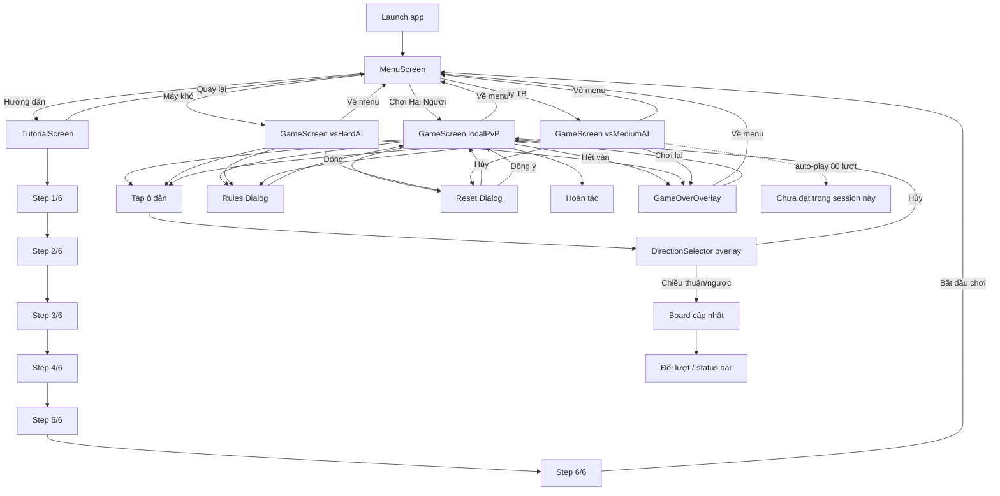
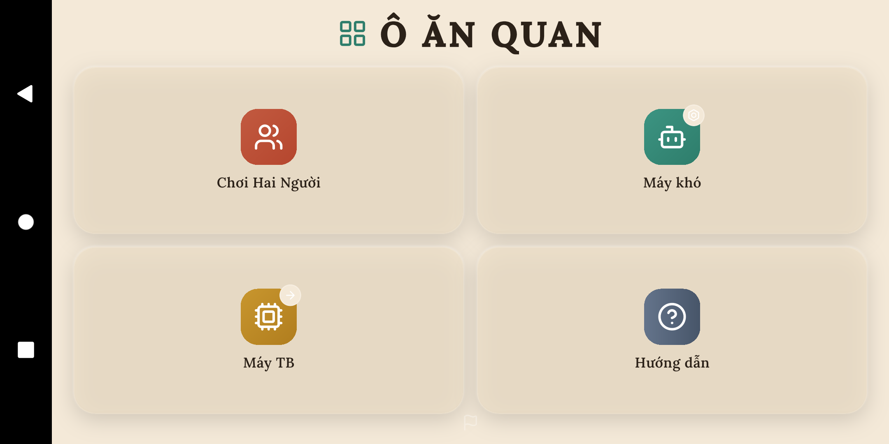
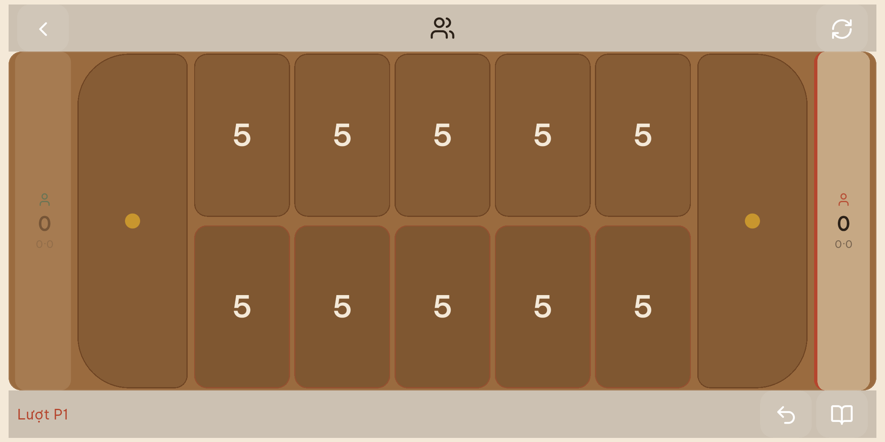
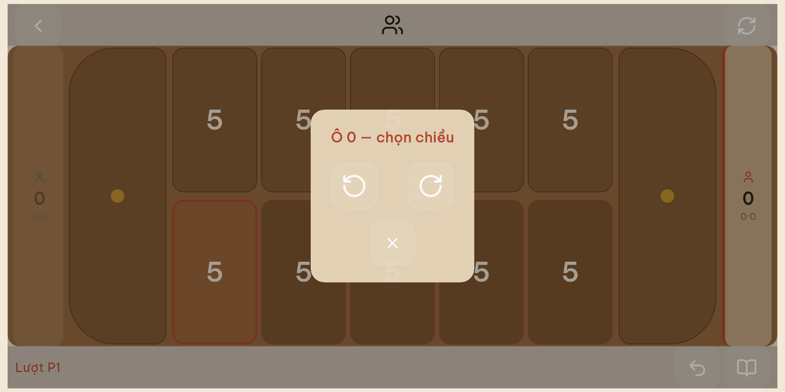
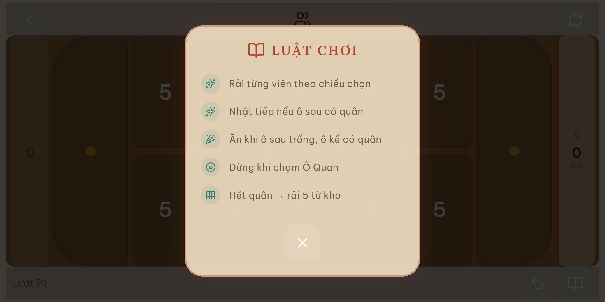
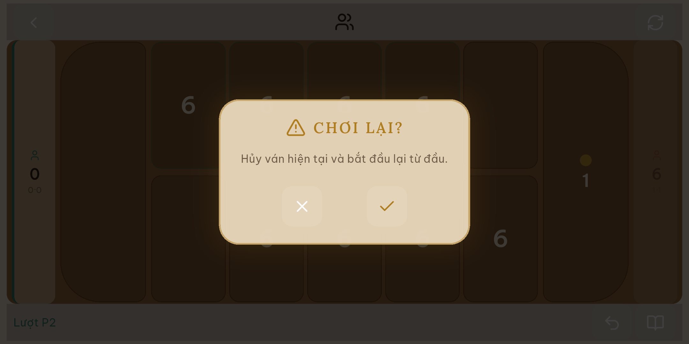

# User Journey Review — Ô Ăn Quan

> **Ngày:** 27/06/2026  
> **Thiết bị:** `emulator-5554` (Android 11, sdk gphone arm64, landscape 2034×1080 logical)  
> **Build:** `app-debug.apk` (assembleDebug)  
> **Phương pháp:** Đóng vai người chơi lần đầu — chạy app thật trên emulator, thao tác bằng **mobile-mcp** (`@mobilenext/mobile-mcp`), chụp screenshot từng bước, đọc a11y tree, ghi cảm nhận ngay sau mỗi màn hình. **Không** suy luận chỉ từ code.

Screenshot lưu tại: [`docs/screenshots/`](screenshots/)

---

## Full flow (toàn bộ hành trình)



---

## Tóm tắt

### Top 3 vấn đề (người chơi không hài lòng)

1. **Màn chơi rối và khó đọc** — nhiều tông nâu chồng lên nhau, rail hai bên + số ô + thanh HUD + overlay cùng lúc; ô quan chỉ có chấm vàng không có số. (🟠)
2. **Nút HUD quá nhỏ** — `Luật chơi` và `Chơi lại` chỉ ~42px rộng (a11y), khó bấm trên điện thoại. (🔴)
3. **Tutorial không giúp hình dung bàn cờ** — icon trừu tượng, chữ mờ; bước 6 ghi "Bắt đầu chơi" nhưng quay về menu chứ không vào ván. (🟠)

### Điểm tốt (nên giữ)

- Menu 2×2 rõ ràng, dễ chọn mode trong vài giây.
- Ô dân hiển thị **một số lớn** — đọc nhanh hơn hàng viên đá neon cũ.
- Dialog xác nhận chơi lại và chọn chiều rải quân có copy tiếng Việt dễ hiểu.
- Status bar dạng câu (`Lượt P1`) gọn hơn chuỗi icon.

---

## Chi tiết theo màn hình

### 1. Menu (`MenuScreen`)



| Tiêu chí | Cảm nhận user |
|----------|----------------|
| Ấn tượng đầu | Hiểu ngay có 4 lựa chọn — ổn. |
| Không hài lòng | Cờ nhỏ góc dưới không có chú thích; không có mode dễ cho người mới; khoảng trống nhiều, cảm giác "chưa phải app game". |
| A11y | Nút có label đầy đủ (`Chơi hai người`, `Máy khó`, …). |

**Mức:** 🟡  
**File:** [`lib/screens/menu_screen.dart`](../lib/screens/menu_screen.dart)

---

### 2. Tutorial — bước 1→6 (`TutorialScreen`)

| Bước | Screenshot | Không hài lòng |
|------|------------|----------------|
| 1/6 | [step1](screenshots/02_tutorial_step1.png) | Icon lưới 2×2 không giống bàn 12 ô; chữ contrast thấp trên nền beige. |
| 3/6 | [step3](screenshots/02_tutorial_step3.png) | Chỉ icon + 1 câu — không minh họa ô "sau", "kế". |
| 6/6 | [step6](screenshots/02_tutorial_step6.png) | Nút **"Bắt đầu chơi"** kỳ vọng vào ván ngay, thực tế về menu → cảm giác bị "đá" ra. |

**Điểm tốt:** Thanh tiến độ `n/6` + chấm; nút Trước/Sau rõ.

**Mức:** 🟠  
**File:** [`lib/screens/tutorial_screen.dart`](../lib/screens/tutorial_screen.dart)

---

### 3. Game — PvP ban đầu (`GameScreen`)



| Tiêu chí | Cảm nhận user |
|----------|----------------|
| Ấn tượng đầu | Nhận ra bàn cờ Ô Ăn Quan, nhưng **không biết ô nào của mình** nếu chưa đọc tutorial. |
| Rối mắt | Nâu đồng nhất; rail trái/phải + số `0·0` khó hiểu; ô quan chỉ chấm vàng; bàn chưa tràn hết chiều ngang (viền beige hai bên). |
| Thao tác | Ô dân ~234×398px — tap tốt. Rail P1 bên phải a11y chỉ **47px** rộng — dễ bị cắt. |
| HUD | `Lượt P1` hữu ích; icon mode giữa header không có chữ. |

**Mức:** 🟠 (rối mắt), 🟡 (rail / quan)  
**File:** [`lib/screens/game_screen.dart`](../lib/screens/game_screen.dart), [`lib/widgets/board_widget.dart`](../lib/widgets/board_widget.dart), [`lib/widgets/game/game_player_rail.dart`](../lib/widgets/game/game_player_rail.dart)

---

### 4. Direction overlay (`DirectionSelector`)



| Không hài lòng | Chi tiết |
|----------------|----------|
| 🟠 Kỹ thuật | Tiêu đề **"Ô 0"** là index nội bộ — user không biết "ô 0" là ô nào trên bàn. |
| 🟡 UX | Overlay + viền đỏ ô chọn + nền bàn vẫn hiện → hơi ngợp. |

**Điểm tốt:** Hai mũi tên lớn, nút Hủy có label a11y.

**File:** [`lib/widgets/direction_selector.dart`](../lib/widgets/direction_selector.dart)

---

### 5. Sau khi rải quân


- Số trên ô thay đổi — phản hồi rõ.
- Vẫn không thấy animation rải → cảm giác "nhảy số" đột ngột.
- Status chuyển lượt nhưng rail + `Lượt P1/P2` trùng thông tin.

**Mức:** 🟡

---

### 6. Dialog Luật chơi



| Không hài lòng | Chi tiết |
|----------------|----------|
| 🟡 Nhất quán | Dialog kiểu neon/cyan (code) vs màn chơi gỗ beige — lệch visual. |
| 🟡 Đóng | Nút X nhỏ ở giữa dưới — dễ miss. |
| 🟠 Lần đầu tap | Nút `Luật chơi` góc phải **42px** rộng — phải tap rất chính xác. |

**Điểm tốt:** 5 dòng luật súc tích, đúng thứ tự chơi.

**File:** [`lib/widgets/game/game_rules_dialog.dart`](../lib/widgets/game/game_rules_dialog.dart), [`lib/widgets/game/game_bottom_hud.dart`](../lib/widgets/game/game_bottom_hud.dart)

---

### 7. Dialog Chơi lại



| Điểm tốt | Nút Hủy / Đồng ý 126×126px — dễ bấm. |
| Không hài lòng | 🟡 Nền game bị dim nặng, khó đối chiếu ván đang chơi khi quyết định reset. |

**File:** [`lib/widgets/game/game_reset_dialog.dart`](../lib/widgets/game/game_reset_dialog.dart)

---

### 8. Game — Máy TB / Máy khó

| Mode | Screenshot | Không hài lòng |
|------|------------|----------------|
| Máy TB | [ai_medium](screenshots/10_game_ai_medium.png) | Không biết khi nào đến lượt máy — không có spinner/trạng thái "Máy đang suy nghĩ". |
| Máy khó | [ai_hard](screenshots/11_game_ai_hard.png) | Cùng layout PvP; badge độ khó chỉ thấy ở rail nhỏ, dễ bỏ qua. |

**Mức:** 🟡  
**File:** [`lib/controllers/game_controller.dart`](../lib/controllers/game_controller.dart)

---

### 9. Game Over overlay

**Trạng thái session:** Chưa đạt sau auto-play ~80 lượt (ván Ô Ăn Quan kết thúc chậm). Screenshot tham chiếu: [mid-game](screenshots/12_game_over_or_late.png).

| Ghi chú | Cần chạy lại manual hoặc session dài hơn để chụp overlay thật. |
| Rủi ro dự đoán (từ code) | Overlay vẫn dùng neon/glass — có thể lệch theme gỗ hiện tại. |

**File:** [`lib/widgets/game/game_over_overlay.dart`](../lib/widgets/game/game_over_overlay.dart)

---

## Bảng tổng hợp

| Màn / Flow | Vấn đề | Mức | Screenshot | File liên quan |
|------------|--------|-----|------------|------------------|
| Menu | Thiếu mode dễ; cờ không gắn nghĩa | 🟡 | 01_menu | menu_screen.dart |
| Tutorial | Icon không khớp bàn; bước 6 misleading | 🟠 | 02_tutorial_step* | tutorial_screen.dart |
| Game board | Tông nâu rối; `0·0` khó hiểu; quan không có số | 🟠 | 04_game_pvp | board_widget, game_player_rail |
| Game board | Rail P1 bị cắt (~47px) | 🟡 | 04_game_pvp a11y | game_screen.dart |
| HUD | Nút Luật / Chơi lại ~42px | 🔴 | 04 a11y | game_top/bottom_hud |
| Direction | "Ô 0" index kỹ thuật | 🟠 | 05_direction | direction_selector.dart |
| Rules dialog | Nút X nhỏ; theme lệch game | 🟡 | 07_rules | game_rules_dialog.dart |
| AI mode | Không feedback lượt máy | 🟡 | 10, 11 | game_controller.dart |
| Game over | Chưa verify trên device | — | 12 (mid-game) | game_over_overlay.dart |

---

## Ưu tiên sửa

### P0 — Blocker UX
- Tăng hit area `Luật chơi` và `Chơi lại` lên ≥48dp (padding hoặc `IconActionButton` full height bar).
- Đổi copy direction: "Ô 0" → vị trí người dùng hiểu (vd. "Ô dưới cùng bên trái" hoặc highlight + bỏ số index).

### P1 — Khó chịu / rối mắt
- Đơn giản màn chơi: giảm tầng visual (1 nguồn hiển thị lượt; rail chỉ điểm + tooltip `dân·quan`).
- Ô quan hiển thị số giống ô dân (hoặc số + chấm quan).
- Tutorial bước 6: đổi "Bắt đầu chơi" → "Về menu" hoặc đi thẳng vào PvP.
- Thêm sơ đồ bàn 12 ô tối thiểu ở tutorial bước 1.

### P2 — Polish
- Menu: thêm mode dễ / onboarding lần đầu.
- AI: indicator "Máy đang đi…" khi `isAnimating`.
- Thống nhất theme dialog/game (cùng palette gỗ hoặc cùng calm dark).
- Chụp & review Game Over sau ván hoàn chỉnh.

---

## Phụ lục — Công cụ & lệnh tái hiện

```bash
# Build & cài
cd /Volumes/m2/dev/o-an-quan-flutter
flutter build apk --debug --no-pub
adb -s emulator-5554 install -r build/app/outputs/flutter-apk/app-debug.apk

# mobile-mcp (đã add: grok mcp add mobile-mcp)
cd ~/.agents/skills/use-mcp/scripts
node call-mobile-mcp.mjs mobile_launch_app '{"device":"emulator-5554","packageName":"com.game.o_an_quan"}'
```

A11y snapshot mẫu (game PvP): [`screenshots/04_game_pvp_a11y.txt`](screenshots/04_game_pvp_a11y.txt)

---

*Báo cáo tạo từ trải nghiệm thực trên emulator + screenshot — không thay thế bằng đọc code đơn thuần.*